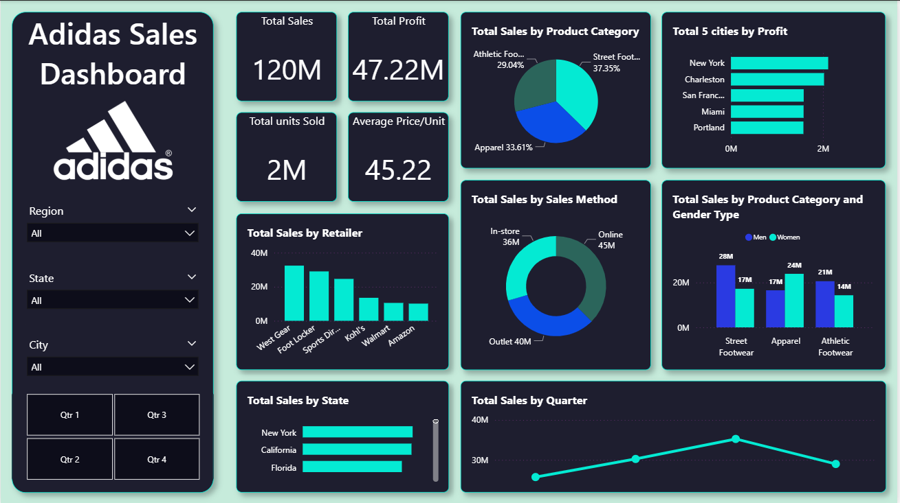

# 👟 Adidas Sales Dashboard

An interactive **Power BI dashboard** providing a complete view of **Adidas sales performance** across regions, states, and product categories. The dashboard highlights sales trends, profitability, retailer contributions, and gender-based buying patterns — enabling business teams to make data-driven decisions.

---

## 📊 Dashboard Overview

The **Adidas Sales Dashboard** helps visualize key performance metrics like total sales, profit, product-wise sales distribution, and customer behavior patterns.  
It provides insights into **regional performance**, **sales methods**, and **retailer contributions**, making it ideal for sales analysis and business forecasting.

---

## 🔹 Key Metrics (KPIs)

- **Total Sales:** 120M  
- **Total Profit:** 47.22M  
- **Total Units Sold:** 2M  
- **Average Price per Unit:** 45.22  

---

## 📈 Visual Insights

| Visualization | Description |
|----------------|-------------|
| **Total Sales by Product Category** | Displays category-wise contribution of Street Footwear, Apparel, and Athletic Footwear. |
| **Top 5 Cities by Profit** | Highlights the cities generating the most profit — led by New York and Charleston. |
| **Total Sales by Retailer** | Compares performance across major retail partners (West Gear, Foot Locker, Walmart, etc.). |
| **Sales Method Distribution** | Shows the split between **Online**, **In-store**, and **Outlet** sales. |
| **Total Sales by Product Category and Gender Type** | Analyzes product category performance among men and women. |
| **Total Sales by State** | Visualizes which U.S. states contribute most to overall sales. |
| **Total Sales by Quarter** | Tracks quarterly sales trends to identify growth patterns over time. |

---

## 🧠 Key Insights

- **Street Footwear** contributes the highest sales share (37%).  
- **New York** leads in profit generation among all cities.  
- **Online sales** outperform **In-store** and **Outlet** methods.  
- **Men** contribute slightly more in all product categories.  
- **Quarter 3** shows the highest total sales during the year.  

---

## ⚙️ Tools & Technologies

- **Power BI Desktop**
- **Data Source:** Excel / CSV dataset
- **Techniques Used:**  
  - DAX Measures for KPIs  
  - Filters for Region, State, City, and Quarter  
  - Dynamic visual interactions  

---

## 🚀 How to Use

1. Download the `.pbix` file from this repository.  
2. Open it using **Power BI Desktop**.  
3. Explore filters on the left panel to view specific region, state, or city performance.  
4. Hover over charts for detailed tooltips and insights.  

---

## 📸 Dashboard Preview

---

## 📁 File Details
- **File Name:** `Adidas_Sales.pbix`  
- **Format:** Power BI Report  
- **Created Using:** Power BI Desktop  

---

⭐ *If you like this dashboard, consider starring ⭐ this repository to show your support!*
